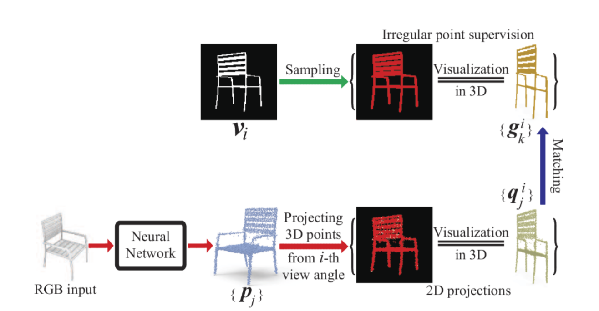

# Unsupervised Learning of Fine Structure Generation for 3D Point Clouds by 2D Projection Matching

Tensorflow implementation of [Unsupervised Learning of Fine Structure Generation for 3D Point Clouds by 2D Projection Matching](https://arxiv.org/pdf/2108.03746.pdf), a paper on ICCV2021.



## Requirements

### installation

The code is in Python 3.6.8. Create Python 3.6.8 environment:

```
conda create -n 2dpm python=3.6.8
conda activate 2dpm
```

Install dependencies:

```
pip install -r requirements.txt
```

## Dataset and pretrained model

we evaluate our method using [ShapeNet v1](https://www.shapenet.org/) for all experiments. 

The original ShapeNet has no corresponding point clouds and rendered images. Therefore, we need to preprocess 3D meshes to obtain point clouds and rendered images.

We provide the same point clouds and rendered images of 3 classes(chair, plane and car) used in our paper as [DPC](https://arxiv.org/abs/1810.09381), you can download them by the [link](https://drive.google.com/drive/folders/1Gn8OW38gGWhtGKbxtC04dXgh_lWu9qJL?usp=sharing), which contains `gt/` and `render/`. the point clouds are only for test. You can also generate ground truth point clouds yourself as described [here](https://github.com/chenchao15/2D_projection_matching/blob/main/2Dpm/densify/README.md).

Firstly, put the `gt/` folder and the  `render/` folder into the `data/` folder.

Secondly, Using the original rendered images to generate silhouettes and 2D sampling points, and save them into TFrecords format (taking the plane(category ID 02691156) as a example): 

```
cd data
./tf_records_generator.sh 02691156
```

A few hours later, you will see the `tf_records/02691156_train.tf_records`.

For convenience, we provide our generated TFrecords files of 3 classes(chair, plane and car) in the [link](https://drive.google.com/drive/folders/1Gn8OW38gGWhtGKbxtC04dXgh_lWu9qJL?usp=sharing), which contains `tf_records/`. you can just put the `tf_records/` folder into the `data/` folder.

We also provide our pretrained model in the [link](https://drive.google.com/drive/folders/1Gn8OW38gGWhtGKbxtC04dXgh_lWu9qJL?usp=sharing). Put them into your **checkpoint_dir**.

## Training

To train our model execute the following, taking the plane(category ID 02691156) as a example:

```
python 2Dpm/main/train_eval.py --gpu=0 --synth_set=02691156 --checkpoint_dir=./
```

All trained models will be saved in checkpoint_dir.

See the configurations in **2Dpm/resources/default_config.yaml** for more detials.

## Test

```
python 2Dpm/main/test.py --gpu=0 --synth_set=02691156 --checkpoint_dir=./ --test_step=100000
```

After the test, we save the quantification results in **checkpoint_dir/chamfer_distance.txt**. The generated 3D shapes are saved in **checkpoint_dir/$vox_size/pred**.

## Acknowledgements

We thank [DPC](https://arxiv.org/abs/1810.09381) for their great works and repos.

## Citation

If you find this project useful in your research, please consider citing:

```
@inproceedings{2DProjectionMatching,
  title={Unsupervised Learning of Fine Structure Generation for 3D Point Clouds by 2D Projection Matching},
  author={Chao Chen and Zhizhong, Han and Yu-shen, Liu and Matthias, Zwicker},
  booktitle={Proceedings of the IEEE International Conference on Computer Vision (ICCV)},
  year={2021}
}
```
